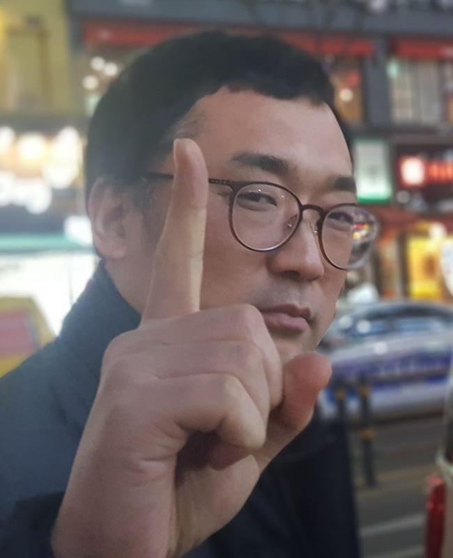

# Welcome to RTOS LAB

We are looking for talented and motivated students to join our lab, on the undergraduate, graduate, and post-doctoral level. Those who are interested in pursuing research in our lab should contact us by email blee AT kgu.ac.kr

## News

- 2020.03.05. Scientific Reports 논문 게재
- 2020.07.01. 헬스허브(주) 인턴쉽
- 2020.07.14. Scientific Reports 논문 게재
- 2020.09.01. Multimedia Tools and Applications 논문 게재 예정
- 2020.09.01. Imaging Science in Dentistry 논문 게재
- 2020.10.21. Korean Journal of Radiology 논문 게재 예정
- 2020.10.21. 2020 한국인터넷정보학회 추계학술발표대회 우수 논문상 수상
- 2021.01.06. Sensors 논문 게재
- 2021.06.15. 석사학생 졸업논문 공개발표
- 2021.06.21. 2021학년 학부연구생 연구실 참여
- 2021.07.23. IEEE Access 논문 게재
- 2021.08.11. Scientific Reports 논문 게재
- 2021.09.01. 2021학년 학부연구생 연구실 참여
- 2021.09.27. Skeletal Radiology 논문 게재
- 2021.10.25. 캡스톤 디자인 및 아이디어 경진대회 금상 수상
- 2021.11.17. 2021년 공개SW 개발자대회 은상 수상

## Members

### Professor  


  

<--->

## Byong-Dai Lee  
**Office:** RM #8317  
**Email:** blee@kyonggi.ac.kr  


### Graduate Student(M.S.)  

  
  

<--->

## Min-ki Kim  
**Office:** RM #8514

<--->  

  

<--->

## Sun-Won Kang  
**Office:** RM #8514  
  

### Undergraduate Student  

  
  

<--->  

## Ki-Ryum Moon
**Office:** RM #8514  
jij7401@naver.com  
[**Github**](https://github.com/jij7401)  

<--->  

  

<--->

## Dong-Hyun Han   
**Office:** RM #8514  
mpolio2@kyonggi.ac.kr
[**Github**](https://github.com/DongHyun99)
  

## Alumni  

- Sunwon Kang (M.S., 2022, expected) 피니뷰(finiview)  
- Ye-Hoon Jang (M.S., 2021) 아토리서치(ATTO Research)  
- Chansu Lee (M.S., 2021) 헬스허브(HealthHub)  
- Myunghoon Jeon (Ph.D., 2019) 퍼즐데이터(PuzzleData)  
- Dong-Joo Choi (M.S., 2017) 쿠팡(Coopang)  
- Han-bin Kim (M.S., 2017) 삼성전자(Samsung Electronics)  
- Dong-Ryeol Kim (M.S., 2017) 현대 엠엔소프트(HYUNDAI MnSOFT)  
- Kwang-Ho Lim (M.S., 2014) 삼성전자(Samsung Electronics)  